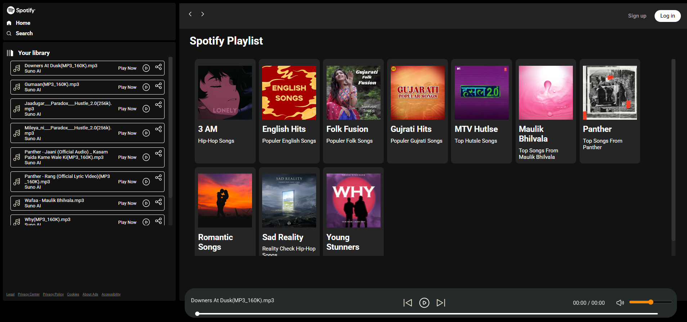

# Spotify-Clone
A fully functional, sleek, and dynamic web-based music player that lets you browse, play, and control audio tracks from organized folders. Inspired by modern streaming platforms like Spotify, this app uses JavaScript, HTML, and CSS to offer a smooth UI and interactive experience.

🚀 Features
🎧 Dynamic playlist generation from local folders

📂 Album/Folder-based music categorization

▶️ Play, pause, next, previous controls

🔊 Volume control and mute toggle

📜 Real-time song name and duration display

⏱️ Interactive seekbar

📱 Mobile-responsive UI

📁 Album metadata support via info.json

📁 Folder Structure
arduino
Copy
Edit
project-root/
│
├── index.html
├── script.js
├── css/
│   ├── style.css
│   └── utility.css
├── img/
│   ├── play.svg
│   ├── pause.svg
│   ├── music.svg
│   ├── close.svg
│   ├── volume.svg
│   ├── mute.svg
│   ├── logo.svg
│   └── home.svg
├── songs/
│   ├── album1/
│   │   ├── song1.mp3
│   │   ├── song2.mp3
│   │   ├── cover.jpeg
│   │   └── info.json
│   └── album2/
│       ├── ...
Each album folder under songs/ should contain:

.mp3 files

cover.jpeg - Cover image for the album

info.json - Album metadata

Sample info.json
json
Copy
Edit
{
  "title": "Peaceful Vibes",
  "description": "Lo-fi chill beats to relax and study"
}
🛠️ How to Run
Download or clone the repository to your machine.

Place your music albums inside the songs/ directory.

Each album must have .mp3 files, a cover.jpeg, and an info.json.

Run a local server (important, due to fetch requests and file reading):

Using VS Code Live Server
Install the "Live Server" extension.

Right-click on index.html → Open with Live Server.

OR Using Python HTTP Server
bash
Copy
Edit
# For Python 3.x
python -m http.server 5500
Then go to: http://127.0.0.1:5500

📦 Dependencies
Vanilla JavaScript

HTML5 & CSS3 (No external JS/CSS libraries)

🔧 Future Enhancements
Search functionality

Shuffle and repeat options

Drag-and-drop song upload

Theme toggle (light/dark)

Lyrics support

